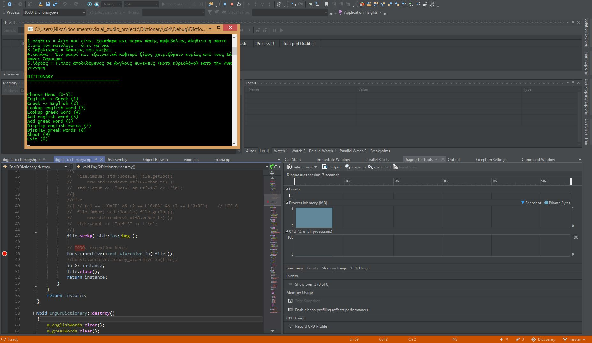

<h1 align="center">
	<a href="https://github.com/KeyC0de/EngGrDictionary">English Greek Dictionary</a>
</h1>

It's what it looks like. I provide a demo with some sample words. 
Basically messing with C++ Boost serialization. 

	

There's a fatal bug currently. - Not done

**Build:** 
I used Windows 8.1 x86_64, Visual Studio 2017, C++17, Boost v1.67 serialization library.

# Contribute

Please submit any bugs you find through GitHub repository 'Issues' page with details describing how to replicate the problem. If you liked it or you learned something new give it a star, clone it, laugh at it, contribute to it whatever. I appreciate all of it. Enjoy.

# License

Distributed under the GNU GPL V3 License. See "GNU GPL license.txt" for more information.

# Contact

email: *nik.lazkey@gmail.com* 
website: *www.keyc0de.net*

# Acknowledgements

[Boost Serialization](https://www.boost.org/doc/libs/1_74_0/libs/serialization/doc/index.html)
